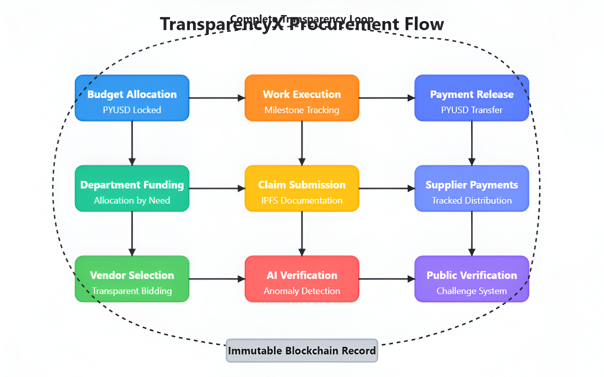
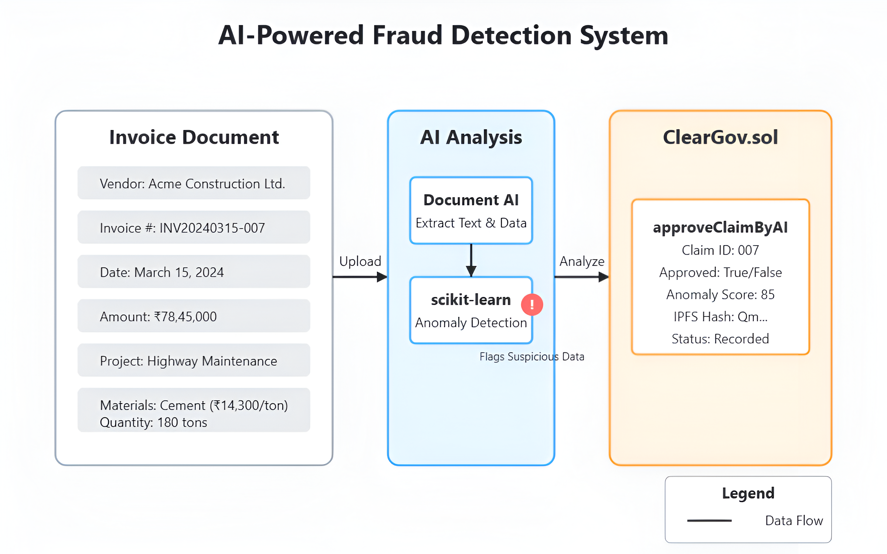

# TransparencyX: Corruption-Proof Government Procurement with PYUSD

[](https://opensource.org/licenses/MIT)
[](https://ethereum.org/)
[](https://www.paxos.com/pyusd/)
[](https://sepolia.etherscan.io/)
[](https://github.com/yourusername/TransparencyX)

## 🌟 Vision: Ending Procurement Corruption Through Blockchain Transparency

**TransparencyX** is a revolutionary decentralized, AI-enhanced government procurement system built on the Ethereum Sepolia testnet using PYUSD stablecoin. Our mission is to combat public sector corruption through immutable financial transparency, automated fraud detection, and public accountability mechanisms.

### The Problem We're Solving: The Global Corruption Crisis


Government procurement corruption represents one of the most significant challenges to global development:

- **$9.5 trillion** lost annually to corruption in developing countries (World Economic Forum)
- Government procurement accounts for **15-30%** of GDP in most countries, with an estimated **20-30%** lost to corruption
- Only **14%** of major corruption cases lead to recovery of stolen assets (UN)
- Over **120 journalists** have been killed exposing corruption cases in the last decade
- Corruption reduces economic growth by **0.5-1%** annually in affected regions
- The World Bank estimates **$1 trillion** is paid in bribes each year globally

In 2018, Indian journalist Gauri Lankesh was assassinated after investigating a major procurement scandal. Her death inspired this project—creating a system where such investigations would be unnecessary because all transactions would be transparent by design.

## 🔍 System Architecture & Innovation

TransparencyX provides end-to-end transparency for government procurement through an innovative combination of blockchain, AI, and public oversight:



### Complete Procurement Flow

1. **Budget Allocation**: Government funds are locked in PYUSD and allocated transparently to departments
2. **Vendor Selection**: All vendor selections are recorded immutably on the blockchain
3. **Claim Submission**: Vendors submit claims with IPFS-stored invoice documentation
4. **AI-Verification**: Document AI extracts invoice details and ML detects anomalies
5. **Payment Chain Tracking**: All payments to vendors, suppliers, and sub-suppliers are tracked
6. **Public Oversight**: Citizens can challenge suspicious claims by staking PYUSD
7. **Dispute Resolution**: Challenges are reviewed with stake rewards for valid concerns

### What Makes TransparencyX Different?

Unlike traditional procurement systems or basic blockchain implementations, TransparencyX:

- **Tracks the complete payment chain** from government to sub-suppliers (not just tier-1 vendors)
- **Incorporates AI verification** of claims and documents before approval
- **Enables public participation** in the oversight process with economic incentives
- **Uses GCP's Blockchain RPC** for powerful transaction tracing that would be cost-prohibitive otherwise
- **Integrates with BigQuery** for advanced analytics and pattern recognition
- **Operates with PYUSD stablecoin** for reliable value storage without cryptocurrency volatility

## ⚙️ Core Technical Components

### 1. Role-Based Access Control System

TransparencyX implements strict role separation to prevent fraud and ensure proper oversight:


#### Role Hierarchy and Responsibilities

- **Main Government**: 
  - Locks overall budget for fiscal periods
  - Sets overall spending policies
  - Appoints state heads and auditors
  - Final approval for large transactions

- **State Heads**: 
  - Allocate budgets to specific departments/projects
  - Monitor departmental spending
  - Approve major procurement decisions

- **Deputies**: 
  - Select and vet vendors for specific projects
  - Set project-specific spending parameters
  - Preliminary approval of large claims

- **Vendors**: 
  - Submit claims with IPFS-stored invoices
  - Receive PYUSD payments
  - Pay suppliers with transparent tracking

- **Suppliers & Sub-suppliers**: 
  - Receive payments in traceable chain
  - Register in the system for payment
  - Provide goods/services documentation

- **Public**: 
  - View all non-sensitive transactions
  - Challenge suspicious claims with PYUSD stakes
  - Earn rewards for identifying fraud

#### Implementation in Smart Contract

```solidity
// Role definitions
bytes32 public constant MAIN_GOVERNMENT_ROLE = keccak256("MAIN_GOVERNMENT_ROLE");
bytes32 public constant STATE_HEAD_ROLE = keccak256("STATE_HEAD_ROLE");
bytes32 public constant DEPUTY_ROLE = keccak256("DEPUTY_ROLE");
bytes32 public constant VENDOR_ROLE = keccak256("VENDOR_ROLE");
bytes32 public constant SUPPLIER_ROLE = keccak256("SUPPLIER_ROLE");
bytes32 public constant AI_SYSTEM_ROLE = keccak256("AI_SYSTEM_ROLE");

// Role management
function grantStateHeadRole(address account) public onlyRole(MAIN_GOVERNMENT_ROLE) {
    _grantRole(STATE_HEAD_ROLE, account);
    emit RoleGranted(STATE_HEAD_ROLE, account, msg.sender);
}

// Role-based access control example
function allocateBudget(
    address department,
    uint256 amount,
    string memory description
) public onlyRole(STATE_HEAD_ROLE) {
    require(amount > 0, "Amount must be greater than 0");
    require(department != address(0), "Invalid department address");
    
    // Transfer PYUSD from state budget to department
    bool success = pyusd.transferFrom(address(this), department, amount);
    require(success, "PYUSD transfer failed");
    
    departmentAllocations[department] += amount;
    
    emit BudgetAllocated(department, amount, description, msg.sender);
}
```

### 2. GCP Blockchain RPC Integration (Key Innovation)

Our system leverages Google Cloud Platform's Blockchain RPC service to provide powerful transaction tracing capabilities that would be cost-prohibitive with other providers:



#### Deep Transaction Tracing

The GCP Blockchain RPC service allows TransparencyX to:

1. **Trace complete payment chains** from government to vendors to suppliers to sub-suppliers
2. **Analyze internal transaction details** that are normally invisible to regular blockchain queries
3. **Detect suspicious patterns** by examining transaction graphs across multiple payments
4. **Optimize gas costs** by offloading heavy computational tasks to GCP

#### Technical Implementation

```javascript
/**
 * Trace a complete payment chain from government to all sub-suppliers
 * This function leverages GCP's Blockchain RPC debug_traceTransaction method
 * to extract detailed transaction data that would be prohibitively expensive
 * to process on-chain.
 */
async function tracePaymentChain(txHash) {
  // Get the transaction trace with full call data
  const trace = await provider.send("debug_traceTransaction", [txHash, {
    tracer: "callTracer",
    tracerConfig: { 
      onlyTopCall: false,
      withLog: true,
      withStorage: true
    }
  }]);
  
  // Extract the complete payment flow data
  const paymentFlow = {
    origin: trace.from,
    timestamp: new Date().toISOString(),
    value: trace.value,
    participants: []
  };
  
  // Process all internal calls recursively
  function processInternalCalls(call, depth = 0) {
    if (call.type === "CALL" && call.value > 0) {
      paymentFlow.participants.push({
        address: call.to,
        value: call.value,
        depth: depth,
        methodId: call.input.substring(0, 10)
      });
    }
    
    // Process recursive calls
    if (call.calls && call.calls.length > 0) {
      call.calls.forEach(subcall => processInternalCalls(subcall, depth + 1));
    }
  }
  
  // Process the trace data
  processInternalCalls(trace);
  
  // Upload the complete payment flow to BigQuery for analysis
  await uploadToBigQuery("payment_flows", paymentFlow);
  
  // Return the processed payment flow
  return paymentFlow;
}
```

This approach allows us to create a complete graph of all payments related to a government contract, including:

- **Direct vendor payments**
- **Vendor-to-supplier transfers**
- **Supplier-to-subcontractor payments**
- **Payment timing patterns**
- **Unusual transaction routing**

Without GCP's Blockchain RPC service, this level of analysis would require:

1. Custom instrumentation of every contract in the payment chain
2. Significantly higher gas costs for event emission
3. Multiple separate queries to reconstruct payment flows
4. Limited visibility into internal transaction details

#### BigQuery Integration for Advanced Analytics

All traced transaction data is stored in BigQuery for advanced analysis:

```javascript
/**
 * Upload payment flow data to BigQuery for analysis
 */
async function uploadToBigQuery(dataset, paymentData) {
  // Create a BigQuery client
  const bigquery = new BigQuery();
  
  // Define the table schema
  const schema = [
    { name: 'txHash', type: 'STRING' },
    { name: 'timestamp', type: 'TIMESTAMP' },
    { name: 'originAddress', type: 'STRING' },
    { name: 'totalValue', type: 'NUMERIC' },
    { name: 'paymentChain', type: 'RECORD', mode: 'REPEATED', fields: [
      { name: 'address', type: 'STRING' },
      { name: 'value', type: 'NUMERIC' },
      { name: 'depth', type: 'INTEGER' },
      { name: 'methodId', type: 'STRING' }
    ]}
  ];
  
  // Insert the data
  await bigquery
    .dataset(dataset)
    .table('transaction_traces')
    .insert(paymentData);
    
  console.log(`Payment flow data uploaded to BigQuery: ${paymentData.txHash}`);
}
```

### 3. AI-Enhanced Verification System

Our system uses advanced AI to verify claims before they're approved:

#### Document AI Pipeline

1. **Document Extraction**: Invoice images/PDFs are processed to extract structured data
2. **Data Validation**: Extracted data is validated against claim information
3. **Anomaly Detection**: ML models identify suspicious patterns in claims
4. **IPFS Storage**: All documents are stored with immutable IPFS hashes

#### Sample AI Processing Flow

```python
def process_invoice(invoice_file, claim_data):
    """
    Process an invoice using Document AI and detect anomalies
    
    Args:
        invoice_file: The invoice PDF or image
        claim_data: The blockchain claim data for verification
        
    Returns:
        dict: Extracted data, anomaly score, and verification results
    """
    # Extract text and structured data from invoice
    document = document_processor.process_document(invoice_file)
    
    # Extract key fields
    extracted_data = {
        'invoice_number': extract_invoice_number(document),
        'date': extract_date(document),
        'amount': extract_amount(document),
        'vendor_name': extract_vendor_name(document),
        'items': extract_line_items(document)
    }
    
    # Verify extracted data against claim data
    verification_results = verify_claim_against_invoice(claim_data, extracted_data)
    
    # Calculate anomaly score using ML model
    features = prepare_features(extracted_data, claim_data)
    anomaly_score = anomaly_model.predict_proba([features])[0][1] * 100
    
    # Store document in IPFS
    ipfs_hash = upload_to_ipfs(invoice_file)
    
    return {
        'extracted_data': extracted_data,
        'verification_results': verification_results,
        'anomaly_score': anomaly_score,
        'ipfs_hash': ipfs_hash,
        'is_suspicious': anomaly_score > 70
    }
```

#### Anomaly Detection Features

Our ML model looks for common patterns of procurement fraud:

- **Price inflation**: Comparing prices to market benchmarks
- **Split purchases**: Detecting multiple small purchases that should be single contracts
- **Shell company indicators**: Unusual company registration patterns or addresses
- **Unusual timing**: Suspicious patterns in submission timing
- **Document irregularities**: Inconsistencies in invoice formatting or details

### 4. Complete Payment Chain Tracking

TransparencyX uniquely tracks the complete payment chain from government to end supplier:

#### Smart Contract Implementation

```solidity
// Vendor pays a supplier from their received funds
function paySupplier(
    uint256 claimId,
    address supplier,
    uint256 amount,
    string memory description
) public onlyVendor {
    require(claims[claimId].vendor == msg.sender, "Not the claim vendor");
    require(claims[claimId].status == ClaimStatus.Paid, "Claim not paid");
    require(amount > 0, "Amount must be greater than 0");
    require(supplier != address(0), "Invalid supplier address");
    
    uint256 paymentId = nextSupplierPaymentId++;
    supplierPayments[paymentId] = SupplierPayment({
        claimId: claimId,
        supplier: supplier,
        amount: amount,
        description: description,
        createTime: block.timestamp
    });
    
    // Transfer PYUSD from vendor to supplier
    bool success = pyusd.transferFrom(msg.sender, supplier, amount);
    require(success, "PYUSD transfer failed");
    
    emit SupplierPaid(paymentId, claimId, msg.sender, supplier, amount, description);
}

// Supplier pays a sub-supplier from their received funds
function paySubSupplier(
    uint256 supplierPaymentId, 
    address subSupplier,
    uint256 amount,
    string memory description
) public {
    require(supplierPayments[supplierPaymentId].supplier == msg.sender, "Not the payment supplier");
    require(amount > 0, "Amount must be greater than 0");
    require(subSupplier != address(0), "Invalid sub-supplier address");
    
    uint256 subPaymentId = nextSubSupplierPaymentId++;
    subSupplierPayments[subPaymentId] = SubSupplierPayment({
        supplierPaymentId: supplierPaymentId,
        subSupplier: subSupplier,
        amount: amount,
        description: description,
        createTime: block.timestamp
    });
    
    // Transfer PYUSD from supplier to sub-supplier
    bool success = pyusd.transferFrom(msg.sender, subSupplier, amount);
    require(success, "PYUSD transfer failed");
    
    emit SubSupplierPaid(subPaymentId, supplierPaymentId, msg.sender, subSupplier, amount, description);
}
```

### 5. Public Challenge System

TransparencyX empowers citizens to actively participate in procurement oversight:

#### Challenge Mechanism

```solidity
// Public stakes PYUSD to challenge a suspicious claim
function stakeChallenge(
    uint256 claimId,
    string memory reason
) public {
    require(claims[claimId].status != ClaimStatus.Rejected, "Claim already rejected");
    require(pyusd.balanceOf(msg.sender) >= stakingAmount, "Insufficient PYUSD balance");
    
    uint256 challengeId = nextChallengeId++;
    challenges[challengeId] = Challenge({
        claimId: claimId,
        challenger: msg.sender,
        reason: reason,
        resolved: false,
        valid: false,
        createTime: block.timestamp,
        resolveTime: 0
    });
    
    // Transfer staking amount from challenger to contract
    bool success = pyusd.transferFrom(msg.sender, address(this), stakingAmount);
    require(success, "PYUSD transfer failed");
    
    // If enough challenges, automatically flag the claim
    claimChallengeCount[claimId]++;
    if (claimChallengeCount[claimId] >= autoFlagThreshold && claims[claimId].status == ClaimStatus.Pending) {
        claims[claimId].status = ClaimStatus.Flagged;
        emit ClaimFlagged(claimId, "Multiple public challenges received");
    }
    
    emit ChallengeSubmitted(challengeId, claimId, msg.sender, reason);
}

// Resolve a challenge and reward staker if valid
function resolveChallenge(
    uint256 challengeId,
    bool isValid,
    string memory resolution
) public onlyRole(MAIN_GOVERNMENT_ROLE) {
    Challenge storage challenge = challenges[challengeId];
    require(!challenge.resolved, "Challenge already resolved");
    
    challenge.resolved = true;
    challenge.valid = isValid;
    challenge.resolveTime = block.timestamp;
    
    uint256 claimId = challenge.claimId;
    
    if (isValid) {
        // Reward the challenger
        bool success = pyusd.transfer(challenge.challenger, stakingAmount * rewardMultiplier);
        require(success, "PYUSD reward transfer failed");
        
        // Mark claim as rejected if it's not already
        if (claims[claimId].status != ClaimStatus.Rejected) {
            claims[claimId].status = ClaimStatus.Rejected;
            emit ClaimRejected(claimId, "Valid public challenge");
        }
    } else {
        // Return staking amount to contract treasury
        treasuryBalance += stakingAmount;
    }
    
    emit ChallengeResolved(challengeId, claimId, isValid, resolution);
}
```

## 🧪 Real-World Use Cases

### Case 1: School Infrastructure Project

A regional government allocates 10 million PYUSD for school infrastructure across 50 schools:

1. **Budget Lock**: Main government locks 10M PYUSD for education department
2. **Allocation**: Education department allocates funds to "School Infrastructure Project"
3. **Vendor Selection**: Deputy selects "BuildRight Construction" as primary vendor
4. **Claim Submission**: BuildRight submits claims with invoices stored on IPFS
5. **AI Verification**: Document AI verifies invoice details match claim amounts
6. **Supplier Tracking**: System tracks BuildRight's payments to cement, furniture, and equipment suppliers
7. **Public Oversight**: Local parent association notices unusual charges, submits challenge
8. **Investigation**: Challenge triggers review, finds inflated furniture prices
9. **Resolution**: Claim rejected, challenger rewarded, investigation launched

### Case 2: Healthcare Equipment Procurement

A health ministry procures ventilators during a pandemic:

1. **Emergency Budget**: 5M PYUSD allocated for ventilator procurement
2. **Vendor Selection**: MedSupply selected as vendor through expedited process
3. **Verification**: AI flags unusual pricing compared to market benchmarks
4. **Transparent Justification**: Ministry provides explanation for premium pricing due to emergency needs
5. **Supply Chain Tracking**: All payments from MedSupply to manufacturers tracked
6. **Public View**: Citizens can verify that ventilators reached hospitals as claimed
7. **Full Accountability**: Complete record of emergency spending maintained

### Case 3: Road Construction Project

A department of transportation manages a major highway project:

1. **Multi-phase Budget**: 50M PYUSD allocated across 3-year project timeline
2. **Multiple Vendors**: System tracks concurrent contracts with construction firms
3. **Material Tracking**: Payments for concrete, asphalt, and steel traced through supply chain
4. **Quality Verification**: Invoices linked to quality inspection reports on IPFS
5. **Milestone Payments**: Releases of funds tied to verified project milestones
6. **Public Challenges**: Citizens can flag discrepancies between claimed work and reality
7. **Analytical Insights**: BigQuery analysis identifies optimal vendors for future projects

## 🚀 Installation and Setup

### Prerequisites

- Node.js v16+
- Python 3.8+
- Google Cloud Platform account with Blockchain RPC API enabled
- MetaMask or another Ethereum wallet with Sepolia testnet ETH
- PYUSD from Paxos faucet

### Environment Setup

1. Clone the repository:
   ```bash
   git clone https://github.com/yourusername/TransparencyX.git
   cd TransparencyX
   ```

2. Set up environment variables:
   ```bash
   cp .env.example .env
   # Edit .env with your API keys and contract addresses
   ```

### Blockchain Component Setup

1. Install dependencies:
   ```bash
   cd blockchain
   npm install
   ```

2. Compile smart contracts:
   ```bash
   npx hardhat compile
   ```

3. Deploy contracts to Sepolia:
   ```bash
   npx hardhat run scripts/deploy.js --network sepolia
   ```

4. Verify contract on Etherscan:
   ```bash
   npx hardhat verify --network sepolia DEPLOYED_CONTRACT_ADDRESS
   ```

### Web Interface Setup

1. Install dependencies:
   ```bash
   cd ../web
   npm install
   ```

2. Configure the application:
   ```bash
   cp src/config.example.js src/config.js
   # Edit config.js with your deployed contract addresses
   ```

3. Start the development server:
   ```bash
   npm start
   ```

### AI System Setup

1. Install Python requirements:
   ```bash
   cd ../ai
   pip install -r requirements.txt
   ```

2. Set up document AI:
   ```bash
   python setup_document_ai.py
   ```

3. Train anomaly detection model:
   ```bash
   python train_anomaly_model.py
   ```

### GCP Blockchain RPC Setup

1. Enable GCP Blockchain RPC API:
   ```bash
   cd ../cloud
   ./setup_gcp_apis.sh
   ```

2. Set up BigQuery tables:
   ```bash
   ./setup_bigquery.sh
   ```

3. Deploy cloud functions:
   ```bash
   ./deploy_cloud_functions.sh
   ```

## 📊 Data Flow and Analytics

### Transaction Data Flow

1. **Smart Contract Events**: All contract interactions emit detailed events
2. **GCP Blockchain RPC**: Listens for events and traces transactions
3. **Cloud Functions**: Process and transform blockchain data
4. **BigQuery Storage**: Structured data stored in analytics-ready format
5. **Dashboard Visualization**: Real-time monitoring and alerts

### Sample BigQuery Schema

```sql
-- Claims table schema
CREATE TABLE IF NOT EXISTS `transparencyx.procurement.claims` (
  `claim_id` INT64,
  `tx_hash` STRING,
  `block_timestamp` TIMESTAMP,
  `vendor_address` STRING,
  `department_address` STRING,
  `amount` NUMERIC,
  `description` STRING,
  `ipfs_hash` STRING,
  `status` STRING,
  `ai_approved` BOOLEAN,
  `anomaly_score` NUMERIC,
  `create_time` TIMESTAMP
);

-- Supplier payment tracking table
CREATE TABLE IF NOT EXISTS `transparencyx.procurement.supplier_payments` (
  `payment_id` INT64,
  `tx_hash` STRING,
  `block_timestamp` TIMESTAMP,
  `claim_id` INT64,
  `vendor_address` STRING,
  `supplier_address` STRING,
  `amount` NUMERIC,
  `description` STRING,
  `create_time` TIMESTAMP
);

-- Challenge tracking table
CREATE TABLE IF NOT EXISTS `transparencyx.procurement.challenges` (
  `challenge_id` INT64,
  `tx_hash` STRING,
  `block_timestamp` TIMESTAMP,
  `claim_id` INT64,
  `challenger_address` STRING,
  `reason` STRING,
  `resolved` BOOLEAN,
  `valid` BOOLEAN,
  `create_time` TIMESTAMP,
  `resolve_time` TIMESTAMP
);
```

### Sample BigQuery Analytics

```sql
-- Identify departments with high anomaly scores
SELECT
  department_address,
  COUNT(*) as total_claims,
  AVG(anomaly_score) as avg_anomaly_score,
  SUM(amount) as total_amount
FROM
  `transparencyx.procurement.claims`
GROUP BY
  department_address
HAVING
  AVG(anomaly_score) > 50
ORDER BY
  avg_anomaly_score DESC;

-- Track payment chain completeness
SELECT
  c.claim_id,
  c.amount as claim_amount,
  SUM(sp.amount) as supplier_payments,
  SUM(ssp.amount) as subsupplier_payments,
  c.amount - SUM(sp.amount) as vendor_kept,
  CASE
    WHEN SUM(sp.amount) < 0.7 * c.amount THEN 'High Vendor Retention'
    ELSE 'Normal Flow'
  END as flow_classification
FROM
  `transparencyx.procurement.claims` c
LEFT JOIN
  `transparencyx.procurement.supplier_payments` sp
  ON c.claim_id = sp.claim_id
LEFT JOIN
  `transparencyx.procurement.subsupplier_payments` ssp
  ON sp.payment_id = ssp.supplier_payment_id
GROUP BY
  c.claim_id, c.amount
ORDER BY
  vendor_kept DESC;
```

## 📱 Future Development

### 1. Mobile Application for All Stakeholders

We're developing comprehensive mobile applications for:

#### Vendor Mobile App

- Submit claims directly from phones with camera integration
- Upload invoice photos for automatic AI processing
- Manage PYUSD payments to suppliers
- Track claim status and respond to challenges

#### Citizen Oversight App

- Browse public procurement data
- Submit challenges with evidence uploads
- Track challenge status and rewards
- Receive alerts for suspicious activities in your region

#### Government Official App

- Secure biometric authentication
- On-the-go approval capabilities
- Real-time budget monitoring
- Analytics dashboard access

### 2. Enhanced AI Fraud Detection

Future versions will include:

- **Entity Relationship Analysis**: Detecting hidden connections between vendors and officials
- **Computer Vision for Infrastructure Verification**: Comparing claimed construction to satellite imagery
- **Predictive Risk Scoring**: Identifying high-risk vendors before issues occur
- **Automated Audit Recommendations**: AI-generated suggestions for human auditors

### 3. Cross-Border Procurement Enhancements

We plan to expand TransparencyX to support:

- **Multi-currency Integration**: Supporting multiple stablecoins
- **Cross-border Payment Tracking**: Following international payment flows
- **Multi-language Document Processing**: AI handling invoices in any language
- **Regional Compliance Rules**: Configurable parameters for different jurisdictions

### 4. DAO Governance Layer

A future governance model will include:

- **Decentralized Audit Committees**: Stakeholder-selected audit groups
- **Parameter Governance**: Community voting on challenge thresholds and rewards
- **Treasury Management**: Community allocation of accumulated fees
- **Protocol Upgrades**: Transparent proposal and implementation process

## 🔒 Security Considerations

TransparencyX implements multiple security layers:

### Smart Contract Security

- **Formal Verification**: Critical contract components formally verified
- **Role-Based Access Control**: Strict permission separation
- **Circuit Breakers**: Emergency pause functionality for critical issues
- **Multi-signature Requirements**: Major parameter changes require multiple approvals

### Data Security

- **Zero-Knowledge Proofs**: Selective disclosure for sensitive procurement details
- **Document Encryption**: Sensitive documents encrypted with appropriate access controls
- **Compliance with Data Protection Regulations**: GDPR and local regulations respected

### Audit Trail

- **Immutable History**: All actions permanently recorded on blockchain
- **Comprehensive Logging**: Every system interaction tracked and attributable
- **Non-repudiation**: Cryptographic proof of all participant actions

## 🌐 Impact and Conclusion

TransparencyX demonstrates how blockchain technology, specifically PYUSD on Ethereum, can transform government procurement by:

1. **Eliminating opportunities for corruption** through immutable transaction records
2. **Reducing investigation costs** through AI-powered automatic verification
3. **Increasing public trust** through stakeholder participation in the verification process
4. **Creating accountability** throughout the entire payment chain
5. **Providing powerful analytics** for systemic improvement

By leveraging GCP's Blockchain RPC service for transaction tracing, we've created a system that would be prohibitively expensive to implement with traditional blockchain methods, making it feasible for government-scale applications.

While our current implementation is on the Sepolia testnet, which has some limitations, the system is designed to work seamlessly on mainnet where even more powerful tracing and analysis would be possible. The potential impact of TransparencyX is enormous, potentially saving trillions of dollars currently lost to procurement corruption while creating more efficient, trustworthy government operations.

## 📜 License

This project is licensed under the MIT License - see the [LICENSE](LICENSE) file for details.

## 🙏 Acknowledgments

- Paxos for PYUSD integration and support
- Google Cloud Platform for Blockchain RPC services
- The memory of Gauri Lankesh and all journalists who risked their lives exposing corruption
- Ethereum community for ongoing development of transparency tools
- Hackathon organizers for the opportunity to showcase this solution
